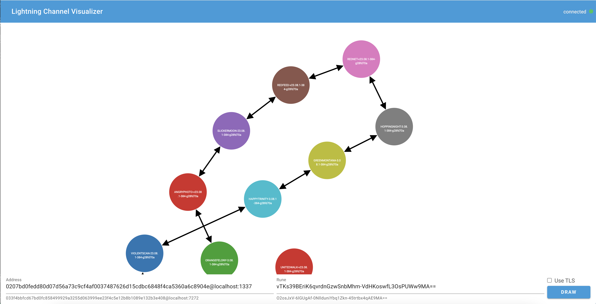

# CLN Lightning Channel Visualizer
This web app plots Lightning nodes and their channels onto a graph.  You can switch between ws:// and secure wss:// via the Use TLS checkbox.  You can view latest updates by clicking the draw button to redraw the graph with the latest data.



## Get started

1. Install the dependencies

```bash
npm i
```

2. Start the app in dev mode

```bash
npm run dev
```

4. Open up [http://localhost:5173](http://localhost:5173) in your browser

## Credits
This is based on boilerplate from https://github.com/aaronbarnardsound/create-coreln-app.
This uses lnmessage https://github.com/aaronbarnardsound/lnmessage to communicate with lightning network nodes.
This uses d3.js https://d3js.org/ to draw the graph.
This uses Svelte Material UI https://sveltematerialui.com/ for ui components.
