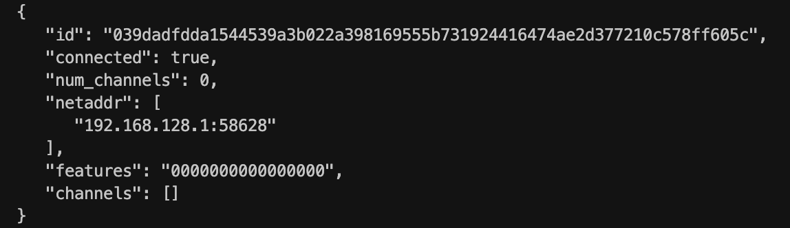

# Lnmessage

[Repo Link](https://github.com/aaronbarnardsound/lnmessage)

## How it Works

- Conceptually can be thought of as spinning up an "ultra light" Lightning node in the browser.
- Can initiate a connection to peers.
- Can send and receive messages to peers.
- Sets all feature flags in the init message to zeros to indicate that this "node" does not support any features.
- Browser gets a unique public key, and once connected to a node, it will show up as a regular peer when running the `listpeers` command:
  
- Handles keeping connection alive (ping, pong).
- Implements [BOLT #1: Base Protocol](https://github.com/lightning/bolts/blob/master/01-messaging.md).
  - Currently only deserialises Init, Ping, Pong and Commando messages, but can be extended to handle any valid Lightning message.
- Implements [BOLT #8: Encrypted and Authenticated Transport](https://github.com/lightning/bolts/blob/master/08-transport.md).

## Connection Types

#### Direct connection using WebSockets
- Requires the `--experimental-websocket-port=PORT` config flag.
- Only CoreLN has this ability currently, but may become [standard at some point](https://github.com/lightning/bolts/pull/891/files)?
- Works great if the browser app is running without TLS (local development).
- If running in production with TLS, then requires that the node also has a TLS cert.
  - Not super simple at the moment, but hopefully will become default in the future?
  - Simple current solution is to use a proxied connection (see below).

#### Direct connection using TCP Sockets
- Not possible in the browser since only WebSockets are supported currently.
- If running a Nodejs or React Native app then this is the best option. No proxy needed and no configuration flags necessary.
- Can also connect to all node implementations this way.

#### Proxied connection from WebSocket -> TCP Socket
- The simplest option for production browser apps.
- Proxy does not require any trust, but does become a central point of failure.
- Proxy receives a WebSocket connection request with IP and Port details and initiates a TCP connection to the node. The proxy then just shuffles encrypted binary traffic between the browser WS connection and the LN node TCP socket connection.

## JS Environments
Lnmessage works anywhere that JavaScript does:
- Browser Apps
- Node JS Apps
- React Native Apps

If you need to connect to a node in other languages, [Lnsocket](https://github.com/jb55/lnsocket) has quite a few language bindings.