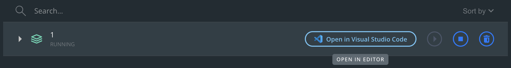
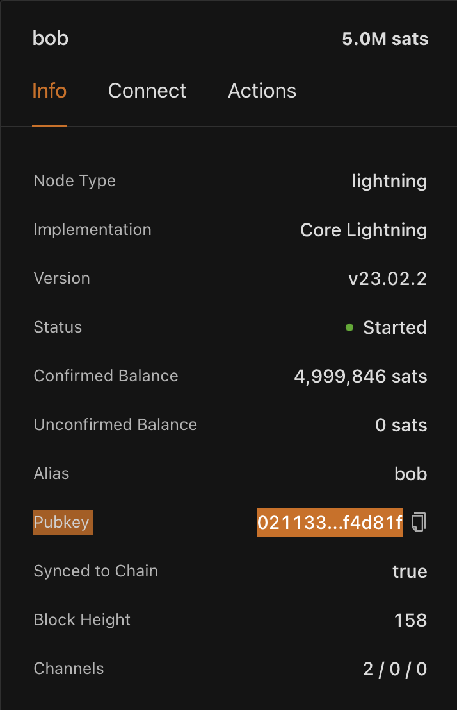
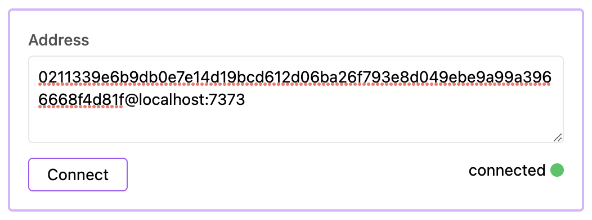
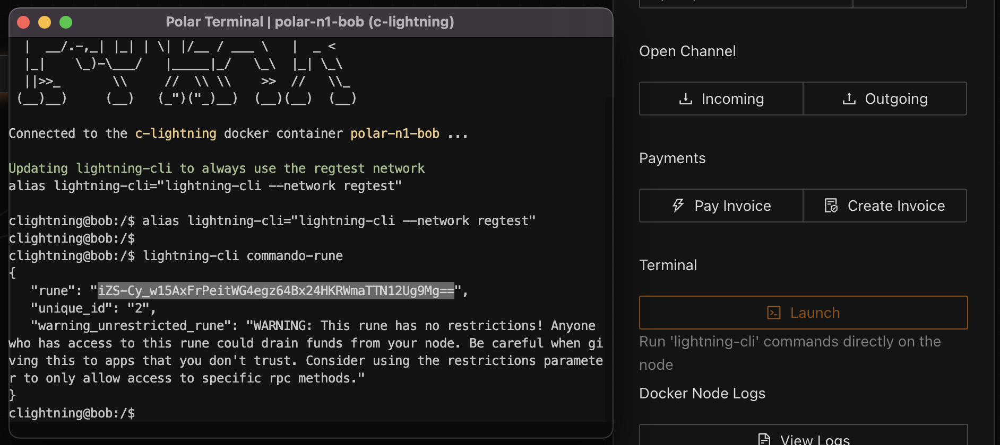

# Regtest Setup

For development, any Core Lightning node running on regtest works great and you can just install Bitcoin and Core Lightning directly and run on regtest. For simplicity we are going to install [Polar](https://lightningpolar.com/) which is an easy way to develop on Lightning regtest.

- Download [Docker](https://www.docker.com/).
- Download [Polar](https://lightningpolar.com/).
- Import the `basic.polar.zip` file in this folder to get a basic network setup that has funded nodes and connected channels.
- Start the network.
- Edit the Docker compose file to expose a websocket port for the node(s) you want to connect.

  - Open Docker dashboard.
  - Open the Docker compose file in your text editor.

  

  - Add `--experimental-websocket-port=PORT` and expose that port.

  

- Stop and re-start the Polar network.
- Copy the pubkey for the CoreLN node that you would like to connect.

- Add connection details to the Sveltekit UI and connect to the node.

- Launch the CLI for the node and create a rune to allow permissions to make RPC requests. For simplicity we will create an admin rune (no restrictions), but check the [docs](https://docs.corelightning.org/reference/lightning-commando-rune) for creating runes with more complex restrictions.

- Copy the created rune and paste in to the rune text box of the Sveltekit UI.
- Try a RPC request on the node!
